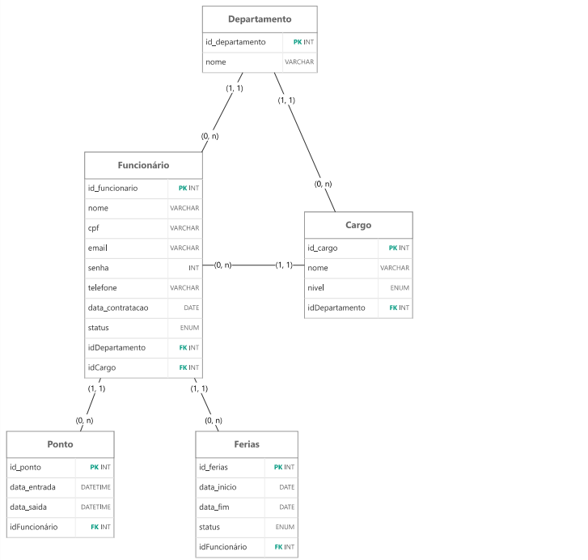

# Sistema de Gerenciamento de Funcionários


O **Sistema de Gerenciamento de Funcionários** é uma aplicação web corporativa voltada para o controle e a organização interna de colaboradores de uma empresa. Desenvolvido no âmbito acadêmico para o 3º Semestre de Projeto Integrador (PI), o projeto integra múltiplos módulos administrativos interligados, regras de negócio, controle de presença, gestão de férias, verificação documental, relatórios e controle de acesso autenticado.

---

## 📋 Sumário

- [1. Contexto do Projeto](#1-contexto-do-projeto)
- [2. Tecnologias Utilizadas](#2-tecnologias-utilizadas)
- [3. Arquitetura do Sistema](#3-arquitetura-do-sistema)
- [4. Estrutura do Banco de Dados](#4-estrutura-do-banco-de-dados)
- [5. Estrutura de Pastas](#5-estrutura-de-pastas)
- [6. Funcionalidades do Sistema](#6-funcionalidades-do-sistema)
- [7. Módulos do Sistema](#7-módulos-do-sistema)
- [8. Relatórios Administrativos](#8-relatórios-administrativos)
- [9. Requisitos Acadêmicos e Restrições](#9-requisitos-acadêmicos-e-restrições)
- [10. Exemplos de Uso (Fluxos)](#10-exemplos-de-uso-fluxos)
- [11. Como Executar o Projeto](#11-como-executar-o-projeto)
- [12. Objetivo Acadêmico](#12-objetivo-acadêmico)

---

## 1. Contexto do Projeto

O objetivo principal da aplicação é centralizar, padronizar e otimizar os fluxos de dados internos relacionados a recursos humanos e operações institucionais. 

O sistema divide-se em duas camadas principais de acesso:
- **Área Pública:** Livremente acessível, destinada à apresentação institucional da empresa, catálogo de departamentos publicáveis e formulários de contato/acesso.
- **Área Administrativa:** Protegida por credenciais de autenticação, permitindo o gerenciamento completo de colaboradores, cargos, departamentos, ponto, férias, documentos e métricas gerenciais.
- **Área Funcionário:** Protegida por credenciais de autenticação, permitindo Visualizar seus próprios dados, Registrar entrada e saída no sistema de ponto, Consultar seu histórico de ponto; Solicitar férias e Consultar o status de suas solicitações de férias.

---

## 2. Tecnologias Utilizadas

| Camada | Tecnologia | Descrição |
| :--- | :--- | :--- |
| **Frontend** | HTML5 / CSS3 / JavaScript | Interface visual estruturada, estilizada e com scripts para dinamismo e manipulação de DOM. |
| **Interface** | Bootstrap | Framework CSS utilizado para auxílio no suporte a componentes responsivos e layout. |
| **Backend** | Java (Nativo) | Processamento de regras de negócio e controle de requisições web sem o uso de Spring Boot. |
| **Persistência** | JDBC | Comunicação direta, rápida e manual com a camada de persistência através de SQL puro. |
| **Banco de Dados**| H2 Database | Sistema de gerenciamento de banco de dados relacional leve e integrado. |

---

## 3. Arquitetura do Sistema

```text
+-------------------------------------------------------------+
|                          FRONTEND                           |
|         HTML5  |  CSS3  |  JavaScript  |  Bootstrap         |
+-------------------------------------------------------------+
                              |
                              | Requisições HTTP (GET/POST)
                              v
+-------------------------------------------------------------+
|                          BACKEND                            |
|                     Java (Sem Spring)                       |
|                             |                               |
|                           JDBC                              |
+-------------------------------------------------------------+
                              |
                              | Consultas / Manipulação SQL
                              v
+-------------------------------------------------------------+
|                       BANCO DE DADOS                        |
|                         H2 Database                         |
+-------------------------------------------------------------+
```
## 4. Estrutura do Banco de Dados

O banco de dados será composto pelas seguintes entidades principais:

### 4.1 DEPARTAMENTO

Armazena os departamentos existentes na empresa.

**Campos:**

- `id` — chave primária;
- `nome`.

Exemplos:

- Administrativo;
- Financeiro;
- TI;
- RH;
- Comercial;
- Produção.

---

### 4.2 CARGO

Armazena os cargos disponíveis na empresa.

**Campos:**

- `id` — chave primária;
- `nome`;
- `nivel`;
- `departamento_id` — chave estrangeira.

Exemplos de níveis:

- Júnior;
- Pleno;
- Sênior.

Um mesmo cargo pode estar associado a vários funcionários.

---

### 4.3 FUNCIONARIO

Armazena os dados dos colaboradores.

**Campos:**

- `id` — chave primária;
- `nome`;
- `cpf`;
- `email`;
- `telefone`;
- `data_nascimento`;
- `data_contratacao`;
- `status`;
- `cargo_id` — chave estrangeira;
- `departamento_id` — chave estrangeira.

---

### 4.4 PONTO

Armazena os registros de entrada e saída dos funcionários.

**Campos:**

- `id` — chave primária;
- `funcionario_id` — chave estrangeira;
- `data`;
- `entrada`;
- `saida`.

---

### 4.5 FERIAS

Armazena as solicitações de férias dos funcionários.

**Campos:**

- `id` — chave primária;
- `funcionario_id` — chave estrangeira;
- `data_inicio`;
- `data_fim`;
- `status`.

Possíveis status:

- Pendente;
- Aprovada;
- Rejeitada.

### DER 



## 6. Funcionalidades do Sistema

### 6.1 Autenticação

O sistema possuirá uma tela de login para acesso às áreas protegidas.

O usuário será identificado pelo tipo de conta:

```text
ADMIN
   |
   +--> Área Administrativa

FUNCIONARIO
   |
   +--> Área do Funcionário
```

---

### 6.2 Funcionários

O administrador poderá:

- Cadastrar funcionário;
- Consultar funcionários;
- Editar funcionários;
- Excluir funcionários;
- Alterar status;
- Associar funcionário a um departamento;
- Associar funcionário a um cargo.

---

### 6.3 Departamentos

O administrador poderá:

- Cadastrar departamentos;
- Consultar departamentos;
- Editar departamentos;
- Excluir departamentos.

---

### 6.4 Cargos

O administrador poderá:

- Cadastrar cargos;
- Definir nível do cargo;
- Associar cargo a um departamento;
- Consultar cargos;
- Editar cargos;
- Excluir cargos.

---

### 6.5 Perfil do Funcionário

O funcionário autenticado poderá visualizar seus próprios dados cadastrados.

A consulta será limitada ao próprio funcionário, evitando que ele tenha acesso aos dados dos demais colaboradores.

---

### 6.6 Controle de Ponto

O funcionário poderá registrar:

- Entrada;
- Saída.

Também poderá consultar seu próprio histórico de registros.

O administrador poderá consultar os registros de ponto dos funcionários.

---

### 6.7 Solicitação de Férias

O funcionário poderá:

- Informar a data de início;
- Informar a data de término;
- Enviar uma solicitação.

A solicitação será inicialmente criada como:

```text
PENDENTE
```

O administrador poderá:

- Aprovar;
- Rejeitar;
- Consultar solicitações.

O funcionário poderá acompanhar o resultado da solicitação.

---

### 6.8 Dashboard Administrativo

O administrador terá acesso a indicadores gerais do sistema, como:

- Total de funcionários;
- Funcionários ativos;
- Funcionários por departamento;
- Solicitações de férias pendentes;
- Registros de ponto.

O dashboard utilizará informações existentes no banco de dados.

---
